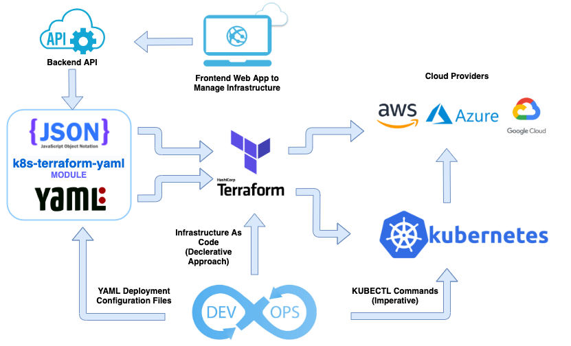

# Terraform-Kubernetes-Yaml Module #
Teaform Module to Deploy Yaml Configurations Files into Kubernetes Cluster 
### Sourcing Application Configuration from outside Terraform code as YAML or JSON #

Terraform is a tool for building, changing, and versioning infrastructure safely and efficiently. Terraform can manage popular cloud providers by means of plugins.Infrastructure is described using a high-level configuration syntax. This allows a blueprint of your datacenter to be versioned and treated as you would any other code. Additionally, infrastructure can be shared and re-used. This concept is called Infrastructure as Code.

See https://www.terraform.io/intro/index.html for more information.

#### Motivation ####

  * Sourcing application deployment configuration for YAML files creates a single source of truth. Same configuration can be used both in declarative approach (Terraform) and Kubectl (Imperative Approach) 
  * Configuring application from outside Terraform using bare configuration text in terms of YAML or JSON makes it possible to an API access and modify the configuration easily.
  * Terraform does not provide this feature embedded in the application, as a plugin or module.
  * Any application can be installed into cluster without writing a particular module for that application. 

  This module makes [Terraform](https://www.terraform.io/) possible to use YAML or JSON files as a source for every resource that is provided by official [Kubernetes provider](https://www.terraform.io/docs/providers/kubernetes/).




### Prerequisites ###

* Pre-configured, running and locally accessible  kubernetes cluster. See [AWS EKS](https://aws.amazon.com/eks/)
* [Terraform Installation](https://www.terraform.io/downloads.html) , version >= 0.12


### Example Usage with [YAML](https://yaml.org) ###
```terraform

# Use your own configuration or leave it blank to use current kubeconfig context.
provider "kubernetes" {

}

# Reads yaml files then merges it into appConfig object.
locals {
  appConfig = merge (
    {
      test-app = {
        k8s = {
          deployment = yamldecode(file("deployment.yml"))
          service    = yamldecode(file("service.yml"))
        }
      } 
    }
  )
}

# Terraform module to utilize yaml fields in configuration.
module "k8s_yaml_tf" {
  source = "github.com/brcnblc/k8s-terraform-yaml" 
  appConfig = local.appConfig
}
```

**Note:** Use the names "deployment", "service" from below list in Further Reading part. You can also use respective resource file name.

[YAML Basic Example Link](https://github.com/brcnblc/k8s-terraform-yaml/tree/master/examples/basic-yaml-sample)


---

**Note:** *This project is under heavy development period. Use with caution and please feel free to open issue about problems.*

---

### Example Usage with [JSON](https://www.json.org/) Configuration file ###

Create `app.auto.tfvar.json` in your terraform project. You can rename app. part but keep the rest of it. Such as `my-app.auto.tfvar.json`or `config-auto.tfvar.json`

See: [app.auto.tfvar.json](https://github.com/brcnblc/k8s-terraform-yaml/blob/master/app.auto.tfvars.json) for full example configuration file.

Edit it as follows:

```json
{
  "appConfig": {
    "application-1":{
      "k8s":{
        "deployment":{

        },
        "service":{

        },
        "configuration_field_name" :{

        }
      }
    },
    "app-2":{

    }
  }
}
```

[JSON Basic Example Link](https://github.com/brcnblc/k8s-terraform-yaml/tree/master/examples/basic-json-config)

Place following code in your terraform project. (Eg: `main.tf`)

```terraform
module "k8s_yaml_tf" {
  source = "github.com/brcnblc/k8s-terraform-yaml" 

  appConfig = var.appConfig
}
```

Run:

```sh
terraform apply
```

If you have already access your cluster it should deploy related apps and services. If not please let me know. 

Please notice that you can install as many application as you want with as many resources as they need without changing the code. You can then use an Api backend to configure JSON file and restructure your configuration. 

Hope it helps. Happy coding :wink:

---

#### Output of k8s-tarraform-yaml module: ####

```
Plan: 4 to add, 0 to change, 0 to destroy.

Do you want to perform these actions?
  Terraform will perform the actions described above.
  Only 'yes' will be accepted to approve.

  Enter a value: yes

kubernetes_service.instance["sec-app"]: Creating...
kubernetes_service.instance["my-app"]: Creating...
kubernetes_deployment.instance["my-app"]: Creating...
kubernetes_deployment.instance["sec-app"]: Creating...
kubernetes_service.instance["my-app"]: Creation complete after 2s [id=default/my-app-7rckh]
kubernetes_service.instance["sec-app"]: Creation complete after 4s [id=default/sec-app-w8qhd]
kubernetes_deployment.instance["sec-app"]: Creation complete after 6s [id=default/sec-app-dqjsm]
kubernetes_deployment.instance["my-app"]: Creation complete after 6s [id=default/my-app-gpnn7]

Apply complete! Resources: 4 added, 0 changed, 0 destroyed.

Outputs:

output = {
  "my-app" = {
    "deployment" = {
      "metadata" = {
        "generation" = 1
        "name" = "my-app-gpnn7"
        "resourceVersion" = "476350"
        "selfLink" = "/apis/apps/v1/namespaces/default/deployments/my-app-gpnn7"
        "uid" = "479576b2-c2b8-4eda-b344-f3cf58286811"
      }
      }
      "spec_template_spec_container" = {
        "imagePullPolicy" = "Always"
      }
      "spec_template_spec_container_resources_limits" = {
        "cpu" = "500m"
        "memory" = "512Mi"
      }
      "spec_template_spec_container_resources_requests" = {
        "cpu" = "250m"
        "memory" = "50Mi"
      }
    }
    "service" = {
      "loadBalancerIngress" = []
      "metadata" = {
        "generation" = 0
        "name" = "my-app-7rckh"
        "resourceVersion" = "476316"
        "selfLink" = "/api/v1/namespaces/default/services/my-app-7rckh"
        "uid" = "74740f99-4ce1-4d72-8562-2867c9c6632d"
      }
      "spec" = {
        "clusterIp" = "10.100.77.16"
        "externalTrafficPolicy" = "Cluster"
      }
      "spec_port" = {
        "nodePort" = 30931
        "targetPort" = "80"
      }
    }
  }
  "sec-app" = {
    "deployment" = {
      "metadata" = {
        "generation" = 1
        "name" = "sec-app-dqjsm"
        "resourceVersion" = "476354"
        "selfLink" = "/apis/apps/v1/namespaces/default/deployments/sec-app-dqjsm"
        "uid" = "3171af8a-f17b-48ce-8b72-fca3fc877632"
      }
      "spec_template_spec_container" = {
        "imagePullPolicy" = "Always"
      }
      "spec_template_spec_container_resources_limits" = {
        "cpu" = "500m"
        "memory" = "512Mi"
      }
      "spec_template_spec_container_resources_requests" = {
        "cpu" = "250m"
        "memory" = "50Mi"
      }
    }
    "service" = {
      "loadBalancerIngress" = [
        {
          "hostname" = "a4e9c0...truncated.....d4....3f1-1....322.eu-central-1.elb.amazonaws.com"
          "ip" = ""
        },
      ]
      "metadata" = {
        "generation" = 0
        "name" = "sec-app-w8qhd"
        "resourceVersion" = "476346"
        "selfLink" = "/api/v1/namespaces/default/services/sec-app-w8qhd"
        "uid" = "4e9c01fc-36e9-448f-86f9-d434ea373f15"
      }
      "spec" = {
        "clusterIp" = "10.100.240.18"
        "externalTrafficPolicy" = "Cluster"
      }
      "spec_port" = {
        "nodePort" = 30663
        "targetPort" = "80"
      }
    }
  }
}

```

Note that the above output includes 4 deployments for 2 applications. 
 * sec-app
    - deployment
    - service - LoadBalancer
 * my-app
    - deployment
    - service - NodePort

__sec-app__ also includes a Load Balancer service which exposes the application to internet. In this case it creates an AWS ELB.

The configuration file for the above deployment is a json file located in the root folder. `app.auto.tfvar.json`. As you may already know when you put json extension terraform interprets these files as JSON.  Please keep the same structure when you prepare your configuration. Such as:

```json
{
  "appConfig": {
    "application-1":{
      "k8s":{
        "deployment":{

        },
        "service":{

        },
        "what-ever-you-use" :{
          "take the names of the resource from related file name": ""
        }
      }
    },
    "app-2":{

    }
  }
}
```
See the full content of the file [app.auto.tfvar.json](https://github.com/brcnblc/k8s-terraform-yaml/blob/master/app.auto.tfvars.json) in root folder.

You can define as many applications as you need with as many resources as your specific requirements. Program is designed so that every resource iterates for every application in the config file where unused resources are not created.

You can also disable applications or, part of the application such as service partially using `disabled : true` in config file. If you want to uninstall all of deployments you can use `module_enabled : false` in the config file. Note that this will destroy all applications at once.

Below application-1 deployment section is disabled, app-2 completely disabled, so that terraform will uninstall the deployment when applied.  

(see `app.auto.tfvar.json`) file
```json
{
  "module_enabled":true,
  "appConfig": {
    "application-1":{
      "k8s":{
        "disabled": true,
        "deployment":{

        }
    },
    "app-2":{
      "disabled":true

    }
  }
}
```
------

### Explicit Dependency ###

Module has a inbuilt dependency object. You can use module_depends_on parameter to assign explicit dependecies. 

Eg:

```terraform
module "k8s_yaml_tf" {
  source = "github.com/brcnblc/k8s-terraform-yaml" 

  appConfig = var.appConfig
  module_depends_on = [aws_eks]
}
```

### Disabling Resources ###

Resource creation can be disabled by module_enabled parameter. You may pass this parameter either inline through module definition or json variable file.

Eg:

```terraform
module "k8s_yaml_tf" {
  source = "github.com/brcnblc/k8s-terraform-yaml" 

  appConfig = var.appConfig
  module_depends_on = [aws_eks]
  module_enabled = false
}
```
 OR using JSON configuration file:

```json
{ "module_enabled": false,
  "appConfig": {
    "application-1":{
      }
    },
    "app-2":{
    }
  }
}
```

Note that disabling module destroys all deployment controllers along with child pods, services, etc... which are installed by the module. Other applications which are not installed by the module will not be affected.

### Further Reading ###

Following names are valid for configuration_field_name:

  * api_service
  * cluster_role
  * cluster_role_binding
  * config_map
  * cron_job
  * daemonset
  * deployment
  * endpoints
  * horizontal_pod_autoscaler
  * ingress
  * job
  * limit_range
  * mutating_webhook_configuration
  * namespace
  * network_policy
  * persistent_volume
  * persistent_volume_claim
  * pod
  * pod_disruption_budget
  * priority_class
  * replication_controller
  * resource_quota
  * role
  * role_binding
  * secret
  * service
  * service_account
  * stateful_set
  * storage_class
  * validating_webhook_configuration

See https://www.terraform.io/docs/providers/kubernetes/ for more details about each section.

Also visit https://kubernetes.io/docs/concepts/ for more information about these concepts.

#### NOTES: #### 
  * Do not change __appConfig__ field name
  * Do not change __k8s__ field name
  * Use __configuration_field_name__ from above list
  * Put your custom definitions under **custom** field under application field such as:
```json
{
  "appConfig": {
    "my-app":{
      "k8s":{
        "custom":{
          "Anything can": "go",
          "here": 0
        }
  }
}
```
  * Write your configuration according to Kubernetes [YAML](https://yaml.org) configuration parameters. See [kubernetes-api/v1.18](https://kubernetes.io/docs/reference/generated/kubernetes-api/v1.18/) or visit [Kubernetes Concepts](https://kubernetes.io/docs/concepts/) to have some idea about configuration files.
  * Use camelCase in configuration fields, since it is default behavior in kubernetes YAML files and program uses camelCased field names as default.
  * Use square brackets indicating that field is an array if it is a list in YAML config file. Eg:

```json
"ports": [
    {
      "containerPort": 3000,
      "name": "http"
    }
  ]
```

Sourcing from:

```yaml
ports:
- containerPort : 3000
  name: http
```


--------

## Advanced Topics ##

Since version 0.12 Terraform introduced new iterators such as for_each. Module heavily utilizes for_each to create resources depending on the demand. for_each also enables us to disable infrastructure since iterator may have zero elements making it posible to enable/disable resources.

### Resource Files ###

Resource is multiplied by the amount of application. Also every section is conditionally created depending on the configuration.

```terraform
resource "kubernetes_deployment" "instance" { 
  depends_on = [null_resource.module_depends_on]
  for_each = local.deployment.applications

  dynamic "metadata" { # Nesting Mode: list  Min Items : 1  Max Items : 1  
    for_each = contains(keys(each.value), "metadata") ? {item = each.value["metadata"]} : {}

    content {
      annotations = lookup(metadata.value, "annotations", null)
      # Type: ['map', 'string']   Optional  
      # An unstructured key value map stored with the deployment that may be used to store arbitrary metadata. More info: http://kubernetes.io/docs/user-guide/annotations
.
.
.
          dynamic "spec" { # Nesting Mode: list  Min Items : 1  Max Items : 1  
            for_each = contains(keys(template.value), "spec") ? {item = template.value["spec"]} : {}

            content {
              active_deadline_seconds = lookup(spec.value, "activeDeadlineSeconds", null)
              # Type: number   Optional  
              # Optional duration in seconds the pod may be active on the node relative to StartTime before the system will actively try to mark it failed and kill associated containers. Value must be a positive integer.
.
.
.
              dynamic "container" { # Nesting Mode: list  
                for_each = lookup(spec.value, "containers", {})

                content {
                  args = lookup(container.value, "args", null)
                  # Type: ['list', 'string']   Optional  
                  # Arguments to the entrypoint. The docker image's CMD is used if this is not provided. Variable references $(VAR_NAME) are expanded using the container's 
                  command = lookup(container.value, "command", null
                  )
                  # Type: ['list', 'string']   Optional  
                  # Entrypoint array. Not executed within a shell. The docker image's ENTRYPOINT is used if this is not provided. Variable references $(VAR_NAME) are expanded using 

                  image = lookup(container.value, "image", null)
                  # Type: string   Optional  
                  # Docker image name. More info: http://kubernetes.io/docs/user-guide/images

```

### Locals ###

Configuration is imported from `var.appConfig` into `local.appConfig` then evaluated to create sub objects for each resource, having application name as key and resource configuration as value. Enabling/Disabling is also handled here.

```terraform
locals {
  api_service = {
    applications = {
      for key, value in var.appConfig :
        key => lookup(lookup(value, "k8s", {}), "api_service", null)
        if contains(keys(lookup(value, "k8s", {})), "api_service") && var.module_enabled && !lookup(lookup(value, "k8s", {}), "disabled", false) && !lookup(lookup(lookup(value, "k8s", {}), "api_service", {}), "disabled", false)
    }
  }

  cluster_role = {
    applications = {
      for key, value in var.appConfig :
        key => lookup(lookup(value, "k8s", {}), "cluster_role", null)
        if contains(keys(lookup(value, "k8s", {})), "cluster_role") && var.module_enabled && !lookup(lookup(value, "k8s", {}), "disabled", false) && !lookup(lookup(lookup(value, "k8s", {}), "cluster_role", {}), "disabled", false)
    }
  }
  .
  .
  .
```

### Outputs ###

Aside from `locals.tf` and respective resource files, program generates `outputs.tf`. So do not edit these files since they are subject to be re-generated by python script.A map of resource computed values are generated to work conditionally according to resource demand. Terraform [try](https://www.terraform.io/docs/configuration/functions/try.html) function guarantees that terraform does not throw error in case of empty resources.


```terraform
output "output" {
value = {
  for app, config in var.appConfig:
    app => {
      api_service = contains(keys(local.api_service.applications), app) ? {
        metadata = {
          generation = try(kubernetes_api_service.instance[app].metadata.0.generation,null)
          # A sequence number representing a specific generation of the desired state.

          name = try(kubernetes_api_service.instance[app].metadata.0.name,null)
          # Name of the api_service, must be unique. Cannot be updated. More info: http://kubernetes.io/docs/user-guide/identifiers#names

          resourceVersion = try(kubernetes_api_service.instance[app].metadata.0.resource_version,null)
          # An opaque value that represents the internal version of this api_service that can be used by clients to determine when api_service has changed. Read more: https://github.com/kubernetes/community/blob/master/contributors/devel/sig-architecture/api-conventions.md#concurrency-control-and-consistency

          selfLink = try(kubernetes_api_service.instance[app].metadata.0.self_link,null)
          # A URL representing this api_service.

          uid = try(kubernetes_api_service.instance[app].metadata.0.uid,null)
          # The unique in time and space value for this api_service. More info: http://kubernetes.io/docs/user-guide/identifiers#uids

        }

      } : null
.
.
.
```

------
### Refreshing Library with Latest Terraform Kubernetes API ###

Run:  
`sh resfresh_library.sh`  
To refresh the library with latest API.
Note that you should have Python3 Installed to refresh the library

### About Python Script ###

There is a python script (`prepare.py`) in the root folder. This is a python 3 script, which reads `provider.json` file to extract resources then prepare terraform files accordingly. It is not needed to run this script every time. The root folder already contains kubernetes resource files created by the script.

You may run the script when ever you want to make a change in the tf files, locals or output.

### How to create provider.json ###

Terraform presents an inline command to create provider file. In the terminal execute the following command if you would like obtain an updated file. (This file already exists in the repository root folder)  
(refresh_library.sh automatically creates it automatically)

```sh
terraform providers schema -json > provider.json     
```

When executed terraform cli prepares an output including all providers used in the project. You can access structure of the resources within this file.

You can also get a tree view of the providers using following command.
```sh
terraform providers
```

Output:
```
.
├── provider.kubernetes
└── provider.null
```

### Considerations ###

The structure does not present an explicit variable to indicate that the attribute is an argument or an output. But there is a field named `computed`. In general I use this field to separate outputs from arguments. However some arguments such as metadata.name has `computed : true` as well. Some manual exception tables are utilized to overcome this unfortunate situation. :grimacing:


The program is started in `prepare.py` as follows:

```python
process_json(
  json_file = 'provider.json',  
  config_var = "appConfig",
  filter = [],
  debug = False,
  verbose = 1,
  long_out = True
  )
```

Run:
  
```
python prepare.py
```
In order to re-generate files:
  * resource files ending with `.tf` extension
  * locals.tf
  * outputs.tf


#### Output of the python program: ####
```
Processing kubernetes_api_service...
Processing kubernetes_cluster_role...
Processing kubernetes_deployment...
.
.
.
Processing kubernetes_service_account...
Processing kubernetes_stateful_set...
Processing kubernetes_storage_class...
```

### Future Plans ###

  * Run YAML configurations from a folder.
  * Merge YAML configuration with JSON configuration
    - Override Configuration
    - Append Configuration
    - Output resulting configuration to YAML

Any contribution is welcome.
bircanbilici@gmail.com
